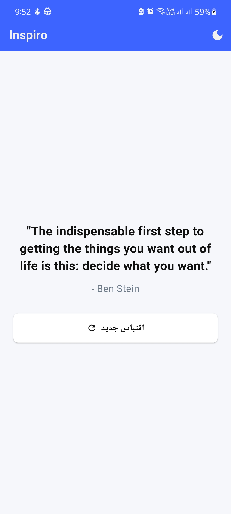
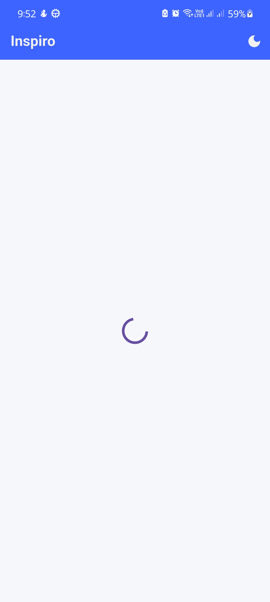

# 🌟 Inspiro

Inspiro هو تطبيق Flutter يقدم اقتباسات تحفيزية عشوائية بواجهة أنيقة ومظلمة، مصمم لتقديم تجربة ملهمة للمستخدم كل مرة يضغط فيها على زر "اقتباس جديد".

 <!-- استبدل هذا برابط لصورة من التطبيق -->

---

## ✨ المميزات

- عرض اقتباسات عشوائية من API.
- تصميم مظلم أنيق (Dark Theme).
- إمكانية التبديل بين Light / Dark Mode.
- إدارة الحالة باستخدام `flutter_bloc`.
- دعم كامل لـ Arabic UI.
- تنظيم الكود بـ Clean Architecture.

---

## 📦 التقنيات المستخدمة

- ✅ Flutter (3.x)
- ✅ flutter_bloc
- ✅ Dio
- ✅ Responsive UI (LayoutBuilder & custom text scaling)
- ✅ Test-driven approach
- ✅ Clean Architecture principles

---

## 🧪 اختبارات

- ✅ اختبار ظهور الاقتباس عند الضغط على الزر.
- ✅ اختبار حالة عدم وجود اقتباس (عرض رسالة للمستخدم).
- ✅ اختبار Bloc states (loading, error, success).

---

## 🚀 التشغيل محليًا

```bash
git clone https://github.com/OmarShawkey13/Inspiro.git
cd Inspiro
flutter pub get
flutter run
```

---

## 📸 صور من التطبيق

| Main View                        | Loading                                |
|----------------------------------|----------------------------------------|
|  |  |

> يمكنك تعديل أو رفع الصور داخل مجلد `assets/screens/` وربطها هنا.

---

## 🧠 الهيكلية (Clean Architecture)

```
lib/
├── core/
│   └── utils/, theme/, network/
├── features/
│   └── home/
│       ├── data/
│       └── presentation/
└── main.dart
```

---

## 👨‍💻 المطور

- **Omar Shawkey**
- GitHub: [@OmarShawkey13](https://github.com/OmarShawkey13)

---

## 📄 الترخيص

مشروع مفتوح المصدر باستخدام [MIT License](LICENSE).
